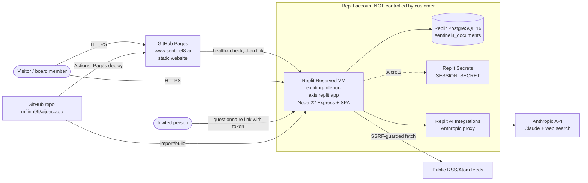
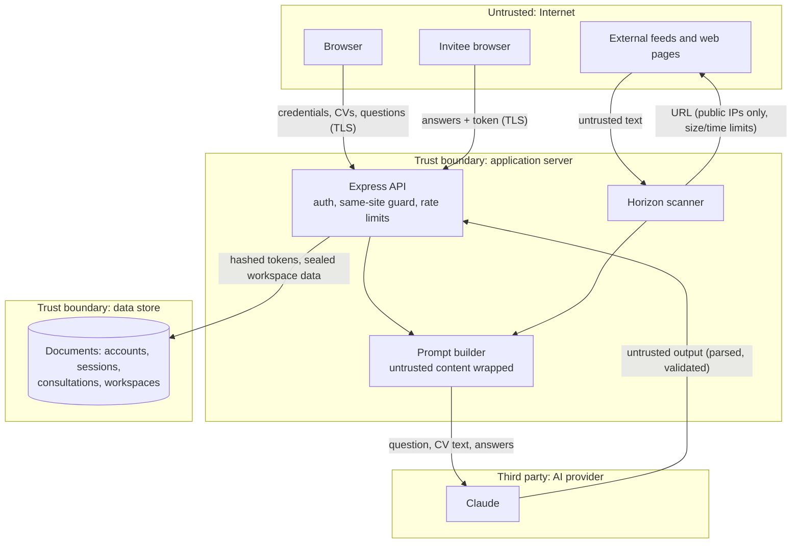

# Sentinel8: current state (verified inventory)

As of 7 October 2026. Each fact is marked **Verified** (checked during this
review, with how) or **Unverified** (not checked, with the blocker). Having
access to the source code says nothing about access to production data,
secrets or deployment settings, so none of those are assumed here.

## 1. Ownership and control

| Asset | Who controls it | Status |
| --- | --- | --- |
| Source repository `github.com/mflinn99/aijoes.app` (public) | GitHub user `mflinn99` | **Verified**: GitHub API, the session's repository scope |
| Default branch `claude/aiogo-metamsp-build-directive-2lsui2` | Same | **Verified**: `git branch -r`. Branch protection status **unverified**: the GitHub settings API returned 403 to this session |
| Website `www.sentinel8.ai` (GitHub Pages from `sage-halpin/site/`) | The repository owner | **Verified**: `sentinel8.ai` resolves to GitHub Pages addresses 185.199.108–111.153 (`getent hosts`). The Pages configuration API returned 403 |
| Domain `sentinel8.ai`: registrar, DNS host, NS, MX, SPF, DKIM, DMARC and CAA records | Unknown | **Unverified**: no DNS tools, and the proxy blocks DNS-over-HTTPS. **Blocks** custom-domain, email and Front Door cut-over steps |
| Live platform `https://exciting-inferior-axis.replit.app` (Replit app `89d53e06-…`, deployment `bfc8a104-…`, status `success`) | **The Replit account behind Claude's Replit connector, not the customer.** The customer gets "Page not found" when they open it | **Verified**: Replit `get_publish_status`, and the customer's own report. **Not customer-controlled** |
| Live platform database (Replit PostgreSQL 16, `DATABASE_URL`) | The same Replit account | **Unverified**: contents, location, backups and encryption are unknown, and this review has no data access. **Blocks** the migration (see `MIGRATION-RUNBOOK.md`) |
| Live platform secrets (`SESSION_SECRET`; AI access through Replit AI Integrations, `AI_INTEGRATIONS_ANTHROPIC_*`) | The same Replit account | **Unverified**: the values were never seen, and the AI spend limit is unknown |
| Azure tenant and subscription | Unknown; none has been provided | **Unverified**. **Blocks** every Azure deployment step |
| Anthropic API key pasted into the chat on an earlier day (`sk-ant-…`) | The customer's Anthropic organisation | **Exposed.** It must be treated as compromised and revoked in the Anthropic Console. Whether it has been revoked is **unverified**. It was not committed: a gitleaks full-history scan found no `sk-ant` string |
| Booking calendar `SENTINEL81@aigogo.ai` (Outlook booking page) | The customer's Microsoft 365 tenant | **Unverified** |

## 2. Application inventory

| Item | Detail | Status |
| --- | --- | --- |
| Product | Sentinel8 "evolving board": AI board agents, consultations (questionnaires to named people), decision log, horizon scanner | Verified (source) |
| Front end | Vite + React 19 single-page app (wouter), served by the same server | Verified |
| Server | Node.js 22, Express 5, bundled to `dist/server.mjs`; one port serves the web app and `/api` | Verified |
| Licences | Package `private: true`, no LICENSE file (all rights reserved by default). Production dependencies: 150 MIT, 8 ISC, 2 BSD-3-Clause, 1 BSD-2-Clause, 1 Apache-2.0, 1 Unlicense, 1 0BSD. No copyleft licences | Verified (`package-lock.json`) |
| Known vulnerabilities | `npm audit --omit=dev`: 0. Dev tooling only: 4 (not shipped) | Verified on 7 Oct 2026 |
| Secrets in git history | gitleaks 8.24.3, 71 commits: 6 findings, all false positives (a public Microsoft client id, a built-in role GUID, an empty placeholder, a test fixture). Allow-listed in `.gitleaks.toml` | Verified |
| Background jobs | Inside the server process: the horizon scanner timer (`HORIZON_SCANNER`, per workspace every 12 hours by default) and the consultation retention sweep | Verified (source) |
| AI | `AI_PROVIDER` = `foundry` (Claude on Microsoft Foundry, managed identity), `anthropic` (API key, or Replit AI Integrations), or `mock` (refused in production). Optional web search tool. New: a daily call cap `AI_DAILY_CALL_LIMIT` (default 2,000 per server) | Verified (source and tests) |
| Outbound integrations | The AI provider; Azure Communication Services email (optional; until a sender domain is verified, links are sent from the lead's own mailbox); horizon feeds (RSS/Atom URLs the organisation enters, fetched through the SSRF-guarded `server/net.ts`) | Verified (source) |
| Email | ACS `EMAIL_SENDER`, not configured anywhere | Verified (source); domain records unverified |

## 3. Data stores, contents and retention

One logical document store (`server/store.ts`): Azure Table Storage (`STORE=table`), PostgreSQL (one table, `sentinel8_documents`) or memory.

| Data | Where (partition) | Sensitivity | Retention |
| --- | --- | --- | --- |
| Accounts: email, name, scrypt password hash | `accounts`, keyed by SHA-256 of the email | Personal | Until the account is deleted |
| Saved workspace (organisation, people, CVs, workspace links) | `accounts`, `data-<id>`, AES-256-GCM sealed with a key derived from `SESSION_SECRET` | Personal and confidential | Until deleted |
| Sessions (new) | `sessions-<account id>`, keyed by a hash of the session id | Credential material (hashed) | 14 days; ended on sign-out |
| Sign-in throttle (new) | `throttle`, keyed by the hash of the email | Low | Self-clearing |
| Consultations: question, invitees (name, role, email), answers, model outputs | `c-<id>`; invite tokens are stored hashed | Personal and commercially sensitive | `CONSULTATION_RETENTION_DAYS` (default 90), then swept |
| Workspaces: profile, lessons, decisions, horizon signals | `w-<id>`; admin token stored hashed | Commercially sensitive | Until the workspace is deleted |

Backups: the Replit database's backups are **unverified**. Azure Table Storage has no point-in-time restore (one reason the ADR moves to PostgreSQL Flexible Server).

## 4. Authentication, roles and tenancy

- **People:** email and password accounts (scrypt N=16384; minimum 12 characters; common-password and own-details checks). Sessions use a signed cookie plus a server record (`__Host-s8_session`, HttpOnly, Secure, SameSite=Lax), last 14 days, and can be revoked. Per-IP and per-account sign-in throttling. Password change needs the current password. Sign out everywhere.
- **No roles and no admin surface.** Every account is equal. There is no operator console, so there is no admin MFA to enforce in the app.
- **Tenancy** is by capability tokens. Each workspace and consultation has a random admin token (stored hashed and checked in constant time), presented as a bearer token. Invitees get one token each. An account "owns" a workspace only because the token sits in its encrypted saved data. Workspaces and consultations **can be created without an account**. A route that bound workspaces to accounts on the server would make the isolation provable; see R-07.
- **No MFA, and no self-service account recovery** (a forgotten password cannot be reset). See R-05 and R-06.

## 5. Current-state diagram

## 6. Data-flow diagram (trust boundaries)

Personal data that crosses into the AI provider: names, roles, CV text and answers, for that question only. The provider's data-processing terms are **unverified** (see `PROVIDER-OBLIGATIONS.md`).

## 7. Traffic and budget

- **Traffic:** unknown. There is no analytics on the website and no metrics from the Replit app are available to this review. Planning assumption (to confirm): fewer than 50 organisations, fewer than 500 sign-ins a day, under 20 GB a month of egress.
- **Budget:** **no approved budget ceiling has been given.** Paid Azure infrastructure must not be committed until the customer states one (see `COST-MODEL.md`).
